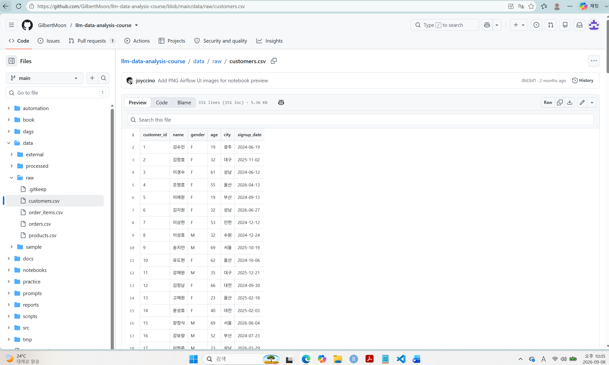
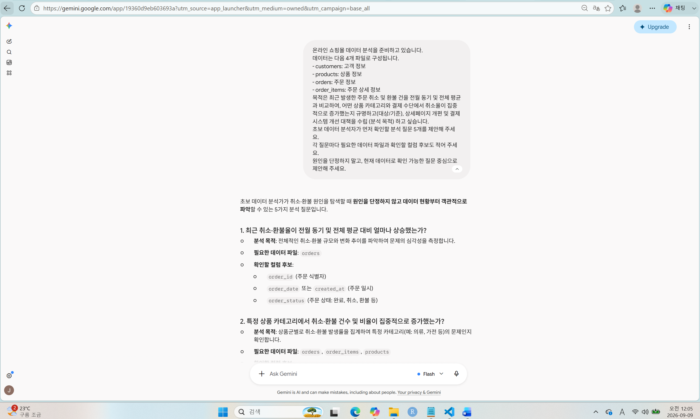
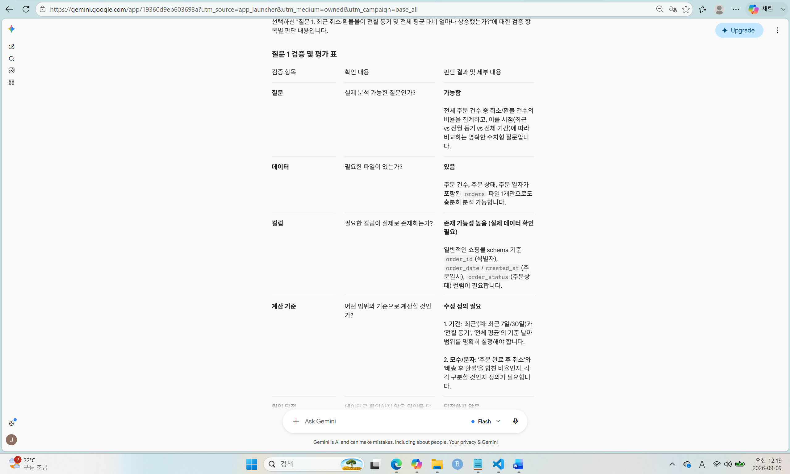
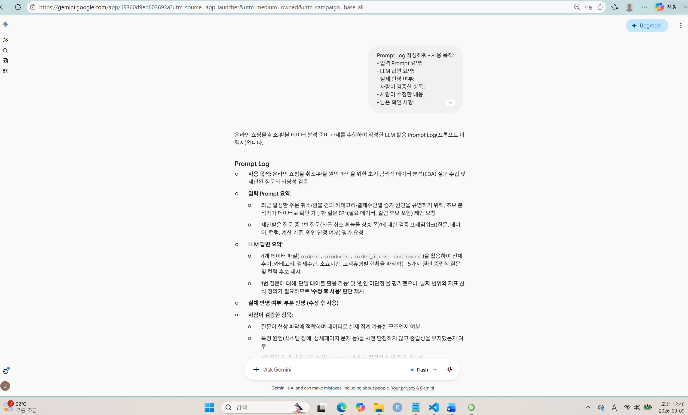

# Chapter 01 제출 답안. AI와 함께하는 데이터 분석의 시작

> 이 파일은 Chapter 01 실습 결과를 정리하여 제출하기 위한 학생용 템플릿입니다.  
> 강사 저장소의 원본 템플릿을 직접 수정하지 말고, 자신의 PC에 복사한 뒤 작성합니다.

---

## 0. 제출 정보

- 이름: 박재선
- GitHub ID: lilypark0930-lab
- 개인 저장소명: `llm-data-analysis-study`
- 작성일: 2026.09.06
- 사용한 LLM: Gemini

### 최종 제출 URL

```text
https://github.com/lilypark0930-lab/llm-data-analysis-study/blob/main/chapter01/chapter01.md
```

---

## 1. 원래 업무 질문

### 내가 선택한 막연한 질문

```text
요즘 주문 취소/환불 사례가 늘어나고 있는 것 같은데, 왜 그런가요?
```

### 왜 이 질문이 모호하다고 생각했는가?

아래 항목과 같은 구체적인 내용이 고려되지 않고 막연한 질문으로 접근하였기 때문에

- 대상: 취소 또는 환불인 주문 건수 및 취소/환불 금액
- 기간: 최근 6개월
- 기준: 월별
- 비교 방법: 시간 대비 비교
- 분석 목적: 취소/환불을 유발하는 특정 원인(품질 이슈, 결제 오류, 특정 고객층 이탈 등)을 규명하고, 상세페이지 개선·결제 시스템 점검·재고 관리 등 해결책 수립

### 분석 가능한 질문으로 다시 작성

```text
최근 발생한 주문 취소 및 환불 건을 전월 동기 및 전체 평균과 비교하여, 어떤 상품 카테고리와 결제 수단에서 취소율이 집중적으로 증가했는지 규명하고(대상/기준), 상세페이지 개편 및 결제 시스템 개선 대책을 수립 (분석 목적) 하고 싶다.
```

### 결과 관찰

이 단계에서 질문이 어떻게 구체화되었는지 작성하세요.
: 대상이 취소/환불인 주문 건수와 금액으로 한정되었고, 기간도 특정 기간 통해 해당되는 범주를 만들었다. 비교 방법도 기간이라는 기준과 어떠한 내용을 분석하고자 하는 지에 대한 구체화를 통해 
세부 방법론을 어떠한 방향으로 잡아가야 할 지 큰 맥락에서 이해를 할 수 있도록 설정할 수 있었다. 

### 나의 해석과 판단

왜 이 질문이 실제 분석에 더 적합하다고 판단했는지 자신의 말로 작성하세요.
: 상기 답변과 같이 항목별 분석할 수 있는 범주를 설정함으로써 그 범위를 기반으로 분석 목적에 맞게 빠른 실행 및 진행을 할 수 있기에 더 적합하다고 생각한다.

### 업무·분석적 의미

이 질문에 답하면 어떤 의사결정이나 다음 분석에 도움이 될 수 있는지 작성하세요.
: 취소/환불을 유발하는 특정 원인(품질 이슈, 결제 오류, 특정 고객층 이탈 등)을 규명하고, 상세페이지 개선·결제 시스템 점검·재고 관리 등 해결책 수립할 수 있다.

### 한계와 추가 확인 사항

현재 질문만으로 알 수 없는 것은 무엇인지 작성하세요.
: 주문 취소 및 환불 건수 및 금액 만으로는 왜 취소했는지 이유을 알기가 어려울 것 같다.

### Evidence


: 별도 질문 구체화 파일은 없음

---

## 2. 질문과 필요한 데이터 연결

### 필요한 데이터 파일

- [확인] `customers.csv`
- [확인] `products.csv`
- [확인] `orders.csv`
- [확인] `order_items.csv`

### 필요한 컬럼 후보

| 파일 | 필요한 컬럼 | 필요한 이유 |
| customers.csv | customer_id | 각 고객 식별 고유 넘버 |
| customers.csv | signup_date | 쇼핑목 처음 가입 일자 |
| orders.csv | order_date | 주문 또는 취소/환불 날짜 |
| orders.csv | payment_method | 결제 수단 정보 |
| orders.csv | order_status | 주문 또는 취소 구분 인자 |
| orders.csv | order_id | 주문 또는 취소 실행 고유 넘버 |
| order_items | quantity | order_id 별 상품 구매 수량 |
| order_items | unit_price | 상품 단가 |
| order_items | product_id | 상품 식별 고유 넘버  |
| products.csv | product_name | 상품 이름  |


### 데이터 연결 관계

```text
필요한 PK/FK 관계 또는 파일 연결 관계를 작성하세요.


customers.signup_date
customers.customer_id

        ↓

orders.customer_id
orders.order_date
orders.payment_method
orders.order_status
orders.order_id

        ↓
order_items.order_id
order_items.quantity
order_items.unit_price
order_items.product_id

        ↓
 products.product_id
 products.product_name

```

### 결과 관찰

각 고객 식별 ID 별, 가입일자, 주문일자, 결제수단, 완료/취소 여부, 수량, 단가, 상품

### 나의 해석과 판단

현재 데이터만으로 질문에 답할 수 있는지 판단하세요.
: 이번 달 주문 취소 및 환불 건을 전월 동기 및 전체 평균과 비교 ==> 가능
  어떤 상품 카테고리와 결제 수단에서 취소율이 집중적으로 증가했는지 규명 ==> 가능
  

### 업무·분석적 의미

질문과 데이터 구조를 먼저 연결하는 것이 왜 중요한지 작성하세요.
: 각 질문 별로 필요한 데이터가 구조적으로 연결되어 있어 그 흐름을 추적해서 Support 할 수 있는지 판단할 수 있가 있기 때문에

### 한계와 추가 확인 사항

실제 컬럼 존재 여부, 타입, 결측 등 아직 확인하지 못한 부분을 작성하세요.
: 월별 기간 비교가 될 만큼 해당 단위 안에 데이터가 충분한지 확인이 필요

### Evidence

필요한 경우 관계도 또는 데이터 파일 확인 화면을 첨부하세요.



: GitHub의 데이터 폴더나 데이터 관계를 확인한 화면 캡처

---

## 3. LLM에게 분석 질문 후보 요청

### 사용 목적

```text
왜 LLM을 사용했는지 작성하세요.
: 제시한 정보를 기반으로 다양한 측면의 Ideation을 위해 사용했음.
```

### 사용한 Prompt

```text
여기에 실제 사용한 Prompt를 붙여 넣으세요.
단, 개인정보·API Key·Secret은 포함하지 마세요.
: 온라인 쇼핑몰 데이터 분석을 준비하고 있습니다.

데이터는 다음 4개 파일로 구성됩니다.

- customers: 고객 정보

- products: 상품 정보

- orders: 주문 정보

- order_items: 주문 상세 정보

목적은 최근 발생한 주문 취소 및 환불 건을 전월 동기 및 전체 평균과 비교하여, 어떤 상품 카테고리와 결제 수단에서 취소율이 집중적으로 증가했는지 규명하고(대상/기준), 상세페이지 개편 및 결제 시스템 개선 대책을 수립 (분석 목적) 하고 싶습니다.

초보 데이터 분석자가 먼저 확인할 분석 질문 5개를 제안해 주세요.

각 질문마다 필요한 데이터 파일과 확인할 컬럼 후보도 적어 주세요.

원인을 단정하지 말고, 현재 데이터로 확인 가능한 질문 중심으로 제안해 주세요. 


```

### LLM 답변 요약

LLM의 전체 답변을 그대로 복사하지 말고 핵심 제안 3~5개를 요약하세요.

1. 최근 취소·환불율이 전월 동기 및 전체 평균 대비 얼마나 상승했는가?
2. 특정 상품 카테고리에서 취소·환불 건수 및 비율이 집중적으로 증가했는가?
3. 특정 결제 수단에 따라 취소·환불 비율에 유의미한 차이가 있는가?
4. 주문 발생 후 취소·환불이 신청되기까지 소요되는 기간은 어떠한가?
5. 신규 고객과 재구매 고객 간의 취소·환불율 차이가 존재하는가?

### 결과 관찰

LLM이 어떤 방향의 질문을 주로 제안했는지 사실 위주로 작성하세요.
: 전체 대비 최근 취소·환불율의 변동 폭을 측정하여 문제의 크기를 먼저 파악하도록 제안함
  요구사항에 포함된 상품 카테고리와 결제 수단별 취소·환불 집계 질문을 제시함.
  주문 발생 시점부터 취소/환불 처리 시점까지의 소요 시간을 확인하는 리드타임 관점 질문을 제안함
  신규 고객과 재구매 고객 간의 행동 차이를 파악하기 위해 고객 속성을 연계한 질문을 제시함
  4개 데이터 파일의 현황을 파악할 수 있는 기초 집계 위주로 구성함.

### 나의 해석과 판단

좋았던 제안과 그대로 사용하기 어려운 제안을 구분해서 작성하세요.
: 1) 좋았던 제안 
  최근 취소·환불율이 전월 동기 및 전체 평균 대비 얼마나 상승했는가?
  특정 상품 카테고리에서 취소·환불 건수 및 비율이 집중적으로 증가했는가?
  특정 결제 수단에 따라 취소·환불 비율에 유의미한 차이가 있는가?

  2) 그대로 사용하기 어려운 제안
  주문 발생 후 취소·환불이 신청되기까지 소요되는 기간은 어떠한가?  
  신규 고객과 재구매 고객 간의 취소·환불율 차이가 존재하는가?

### 업무·분석적 의미

LLM이 분석 시작 단계에서 어떤 도움을 줄 수 있다고 생각하는지 작성하세요.
: 주어진 데이터를 중심으로 다양한 관점에서 문제 해결에 대한 Ideation을 할 수 있다고 생각한다.

### 한계와 추가 확인 사항

LLM 답변에서 실제 데이터로 검증해야 할 내용을 작성하세요.
: '최근'과 '전월 동기'를 정의할 기준 날짜 컬럼이 '주문일' 기준인지, '취소/환불 완료일' 기준인지에 따른 지표 차이 검증 필요.
   한 주문(order_id)에 여러 상품(product_id)이 포함되었을 때 부분 취소/환불이 어떻게 기록되는지(order_items 단위 집계 가능 여부) 데이터 구조 확인 필요.

### Evidence



: 첨부 완료

---

## 4. LLM 제안 검증

LLM 제안 중 하나 이상을 선택해 검토합니다.

| 검증 항목 | 확인 내용 |
| --- | --- |
| 선택한 LLM 제안 | 최근 취소·환불율이 전월 동기 및 전체 평균 대비 얼마나 상승했는가? |
| 필요한 파일 | orders.csv |
| 필요한 컬럼 | order_id, order_date, order_status |

| 계산 범위 | 수정 정의 필요

1. 기간: '최근'(예: 최근 7일/30일)과 '전월 동기', '전체 평균'의 기준 날짜 범위를 명확히 설정.
2. 모수/분자: '주문 완료 후 취소'와 '배송 후 환불'을 합친 비율인지, 각각 구분할 것인지 정의가 필요. |

| 실제 데이터 확인 필요 여부 | 확인|
| 원인 단정 여부 | 단정하지 않음 |
| 최종 판단 | 수정 후 사용 |

### 내가 수정한 내용

```text
LLM 제안을 수정했다면 무엇을 어떻게 바꿨는지 작성하세요.

: 계산 기준(기간 및 지표 정의)을 아래와 같이 명확하게 다듬은 후 SQL/Python 분석을 진행
기간 범위 산정 예시:
최근 기간: 2026-08-01 ~ 2026-08-31 (최근 1개월)
전월 동기: 2026-07-01 ~ 2026-07-31 (전월 1개월)
전체 평균: 전체 보유 데이터 기간의 월평균 취소/환불율지표

지표 산식 명시:취소·환불율 = status가 'CANCELLED' 또는 'REFUNDED'인 주문 건수 / 전체 주문 건수 (order_id 수)
```

### 결과 관찰

검증 과정에서 확인된 사실을 작성하세요.
:  별도의 테이블 조인없이 orders 테이블 1개만으로 집계가 가능한 구조임을 확인.
   LLM이 제안한 질문 문장에는 '최근', '전월 동기', '전체 평균'이라는 시점 표현만 존재할 뿐, 정확한 날짜 범위(예: 30일, 7일 등)와 취소/환불율 산식(분모/분자 정의)이 구체적으로 명시되어 있지 않았음.
   단순 수치 집계 및 추이 비교 형태로 구성된 질문임을 검증.

### 나의 해석과 판단

왜 `사용 / 수정 후 사용 / 보류` 중 해당 결정을 내렸는지 작성하세요.
: 수정 후 사용
분석을 실제 SQL 쿼리나 코드로 구현하기 위해서는 '최근'의 일자 범위와 '취소/환불'의 대상 상태값을 명확히 정의하는 사전 작업이 반드시 선행되어야 하기 때문.

### 업무·분석적 의미

LLM 제안을 검증하지 않고 바로 사용하는 경우 어떤 문제가 생길 수 있는지 작성하세요.
: 지표 산출 오류 및 재작업 발생, 잘못된 의사결정 유도

### 한계와 추가 확인 사항

아직 실제 데이터로 검증하지 못한 부분을 명확히 작성하세요.
: 실제 DB Schema 및 컬럼명 일치 여부, 코드값 명세 확인, 주문 기준 vs 처리 기준 시점 결정

### Evidence



---

## 5. Prompt Log

- 사용 목적: 온라인 쇼핑몰 취소·환불 원인 파악을 위한 초기 탐색적 데이터 분석(EDA) 질문 수립 및 제안된 질문의 타당성 검증
- 입력 Prompt 요약: 
최근 발생한 주문 취소/환불 건의 카테고리·결제수단별 증가 원인을 규명하기 위해, 초보 분석가가 데이터로 확인 가능한 질문 5개(필요 데이터, 컬럼 후보 포함) 제안 요청
제안받은 질문 중 '1번 질문(최근 취소·환불율 상승 폭)'에 대한 검증 프레임워크(질문, 데이터, 컬럼, 계산 기준, 원인 단정 여부) 평가 요청
- LLM 답변 요약: 
4개 데이터 파일(orders, products, order_items, customers)을 활용하여 전체 추이, 카테고리, 결제수단, 소요시간, 고객유형별 현황을 파악하는 5가지 원인 중립적 질문 및 컬럼 후보 제시
1번 질문에 대해 '단일 테이블 활용 가능' 및 '원인 미단정'을 평가했으나, 날짜 범위와 지표 산식 정의가 필요하므로 '수정 후 사용' 판단 제시
- 실제 반영 여부: 수정 후 사용
- 사람이 검증한 항목: 
문이 현상 파악에 적합하며 데이터로 실제 집계 가능한 구조인지 여부
특정 원인(시스템 장애, 상세페이지 문제 등)을 사전 단정하지 않고 중립성을 유지했는지 여부
1번 질문 집계 시 필요한 파일(orders)과 필요 컬럼의 실제 존재 가능성
- 사람이 수정한 내용:
기간 범위 명확화: 모호한 '최근' 및 '전월 동기'의 날짜 범위를 특정 기간(예: 최근 30일 vs 전월 동기 30일)으로 명시
지표 산식 표준화: 취소·환불율 계산 시 분모(전체 주문 건수)와 분자(취소/환불 상태 건수)의 기준을 명확한 수식으로 정의
- 남은 확인 사항:
실제 DB 내 orders 테이블의 정확한 컬럼명 조회
order_status 컬럼에 담긴 공통 코드값의 명세 확인

### 결과 관찰

LLM 사용 기록에서 어떤 의사결정 과정을 확인할 수 있는지 작성하세요.
: 분석 목적(취소율 증가 원인 규명 및 개편 대책 수립) 달성을 위해 LLM으로부터 다양한 질문을 폭넓게 제안받아 분석 프레임워크를 조기에 구축

### 나의 해석과 판단

Prompt Log를 남기는 것이 왜 필요한지 자신의 말로 작성하세요.
: 데이터 왜곡 위험을 방지, 과정 전반을 동료 및 의사결정자에게 명확히 전달하여 보고 및 협업 과정에서의 설득력을 확보

### Evidence



---

## 6. 개인정보와 Secret 보호 확인

다음 항목을 확인합니다.

- [O] 실제 이름·이메일·전화번호 등 고객 개인정보를 Prompt에 사용하지 않았습니다.
- [O] API Key를 코드나 Notebook에 직접 작성하지 않았습니다.
- [O] `.env` 실제 내용을 캡처하거나 업로드하지 않았습니다.
- [O] GitHub Token, 비밀번호, 내부 URL이 캡처에 보이지 않습니다.
- [O] 제출 전 이미지까지 다시 확인했습니다.

### 나의 판단

이번 실습에서 어떤 정보는 LLM 또는 Public GitHub에 올리면 안 된다고 판단했는지 작성하세요.
: 고객 개인정보, API Key
---

## 7. Chapter 01 Notebook 확인

Notebook:

```text
notebooks/ch01_ai_data_analysis_intro.ipynb
```

### 내 환경 상태

- [O] 아직 환경설정 전이라 Notebook 위치만 확인했습니다.
- [ ] 환경설정이 완료되어 Notebook을 직접 실행했습니다.

### 환경설정 완료 학생만 작성

#### 실행한 코드

```python
from pathlib import Path

import pandas as pd
import numpy as np
import matplotlib.pyplot as plt
import seaborn as sns

DATA_DIR = Path('../data/raw')
sns.set_theme(style='whitegrid')
```

#### 실행 결과

```text
오류 없이 실행되었는지 작성하세요.
```

#### 결과 관찰

실행 결과에서 확인한 사실을 작성하세요.

#### 나의 해석과 판단

현재 Notebook이 본격 분석이 아니라 starter scaffold라는 의미를 자신의 말로 설명하세요.

#### 한계와 추가 확인 사항

Chapter 02 또는 Chapter 03에서 추가로 확인해야 할 내용을 작성하세요.

#### Evidence


> 환경설정 전이라면 이 이미지는 생략할 수 있습니다.

---

## 8. Chapter 01 최종 해석

### 이번 장에서 가장 중요하다고 생각한 내용

```text
자신의 말로 3~5문장 작성하세요.
: 데이터 분석에서 LLM은 완성된 정답을 주는 도구가 아니라, 초기 아이디어와 프레임워크를 빠르게 확장해 주는 협력 도구라는 점입니다. LLM이 제안한 질문과 로직을 검증 없이 수용하면 잘못된 지표 정의나 데이터 구조 불일치로 인한 오류가 발생할 수 있습니다. 따라서 분석 목적에 맞게 질문을 구체화하고, 날짜 범위나 산식과 같은 계산 기준을 직접 다듬는 인간의 검증이 무엇보다 중요합니다.
```

### LLM을 데이터 분석에 사용할 때 가장 조심해야 할 점

```text
자신의 판단을 작성하세요.
: LLM은 그럴듯하지만 존재하지 않는 컬럼명이나 잘못된 데이터 구조를 제시할 수 있으며, 비즈니스 맥락에 맞지 않는 추상적인 질문을 제공할 수 있습니다. 따라서 제안받은 질문이 실제 데이터로 집계 가능한지, 특정 원인을 단정하는 편향이 없는지 신중히 검증하고 보완하는 비판적 사고를 항상 유지해야 합니다.

```

### 사람과 LLM의 역할 차이

| 항목 | LLM이 도울 수 있는 부분 | 사람이 책임져야 하는 부분 |
| --- | --- | --- |
| 질문 정의 | 다양한 관점의 탐색적 질문 및 프레임워크 아이디어 제안 | 비즈니스 목적과 맥락에 맞는 핵심 질문 선별 및 구체화 |
| 데이터 확인 | 질문 해결에 필요한 예상 테이블 및 컬럼 구조 매핑 | 실제 DB Schema, 코드값, 데이터 유효성 및 결측치 검증  |
| 코드 작성 | SQL 쿼리, Python 초안 코드 및 구문 예시 신속 작성 | 환경에 맞는 쿼리 수정, 로직 오류 수정 및 실행 결과 검증 |
| 결과 해석 | 추출된 집계 데이터의 통계적 패턴 및 현상 요약 | 비즈니스적 맥락 파악 및 현상의 실제 원인 종합 추론 |
| 최종 판단 | 실행 가능한 선택지 및 개편 대책 아이디어 제공 | 대책 실행의 우선순위 결정, 리스크 관리 및 최종 의사결정 |

### 다음 Chapter에서 확인하고 싶은 것

```text
이번 장에서 남은 의문이나 Chapter 02~03에서 확인하고 싶은 내용을 작성하세요.
: 이번 장에서 수립하고 검증한 분석 질문과 지표 산식을 실제 SQL 쿼리나 Python 코드로 구현할 때, 발생할 수 있는 데이터 오류를 LLM과 함께 효율적으로 디버깅하는 실무 테크닉을 확인하고 싶습니다.
```

---

## 9. 최종 제출 체크리스트

- [O] 원래 업무 질문과 구체화한 분석 질문을 작성했습니다.
- [O] 질문에 필요한 데이터 파일과 컬럼 후보를 정리했습니다.
- [O] LLM Prompt와 답변 요약을 작성했습니다.
- [O] LLM 제안을 실제 데이터 관점에서 검증했습니다.
- [O] 각 핵심 STEP의 결과 관찰을 작성했습니다.
- [O] 각 핵심 STEP의 나의 해석과 판단을 작성했습니다.
- [O] 업무·분석적 의미를 작성했습니다.
- [O] 한계와 추가 확인 사항을 작성했습니다.
- [O] 핵심 실행 Evidence 이미지를 첨부했습니다.
- [O] 이미지가 Markdown에서 정상 표시됩니다.
- [O] 개인정보가 없습니다.
- [O] API Key·Secret·Token이 없습니다.
- [O] 개인 GitHub 저장소에 업로드했습니다.
- [O] GitHub에서 Markdown과 이미지가 정상 표시됩니다.
- [O] 아래 최종 파일 URL이 정상적으로 열립니다.

### 최종 파일 URL

```text
https://github.com/lilypark0930-lab/llm-data-analysis-study/blob/main/chapter01/chapter01.md

```

---

## 10. 교수자 확인용 요약

### 수행 상태

- [ ] COMPLETE
- [ ] PARTIAL

### 내가 가장 중요하게 내린 판단 1개

```text
여기에 작성하세요.
```

### 아직 확인이 필요한 내용 1개

```text
여기에 작성하세요.
```
