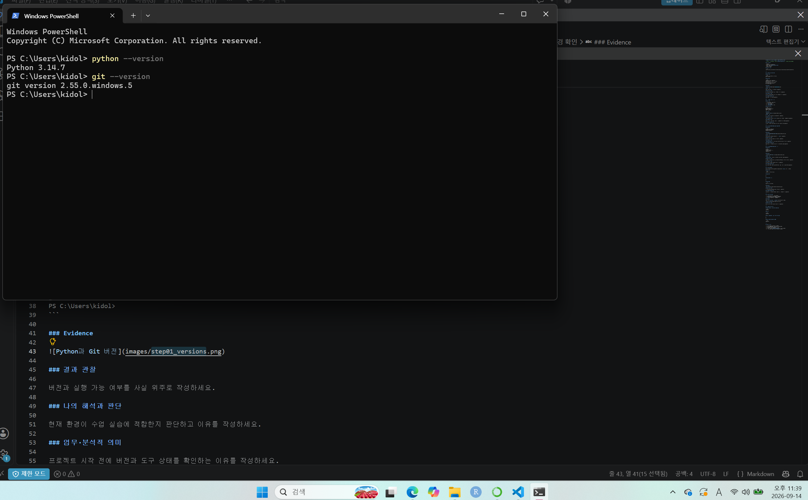
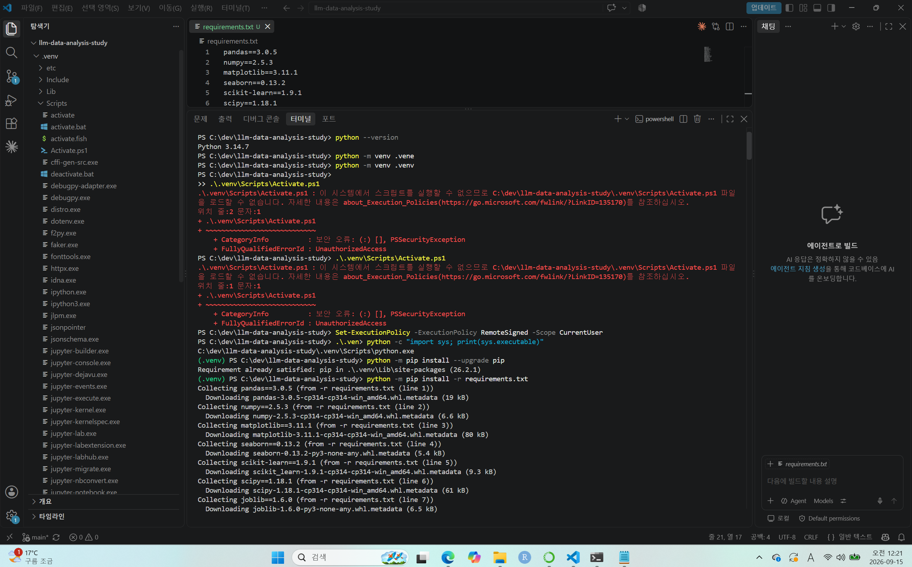
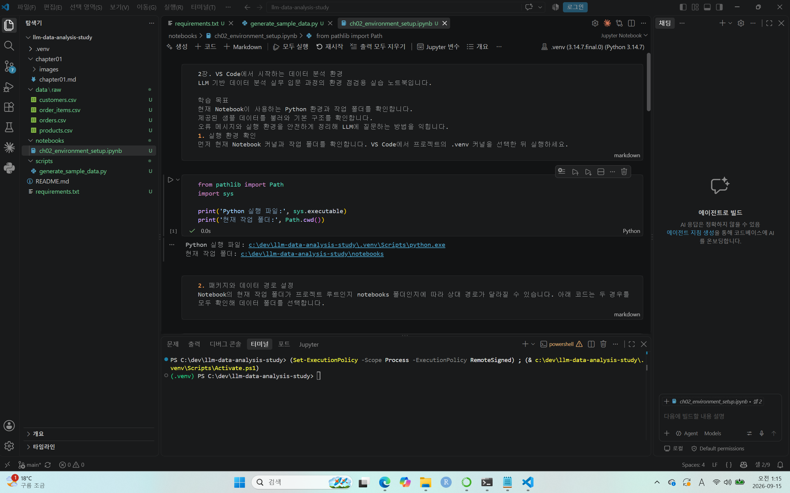
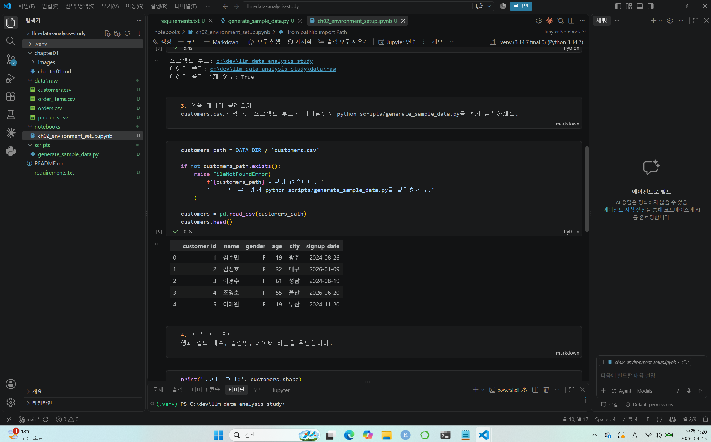
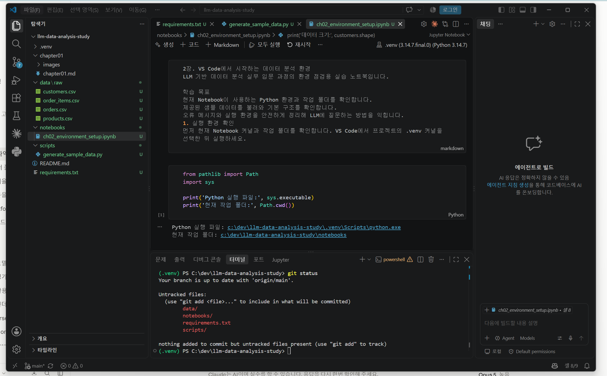

# Chapter 02 제출 답안. VS Code에서 시작하는 데이터 분석 환경

> 최종 파일은 개인 GitHub 저장소의 `chapter02/chapter02.md`로 저장하는 것을 권장합니다.

## 0. 제출 정보

- 이름: 박재선
- GitHub ID: lilypark0930-lab
- 개인 저장소: `llm-data-analysis-study`
- 작성일: 2026.09.14
- 운영체제: Window 

### 최종 제출 URL

```text
https://github.com/lilypark0930-lab/llm-data-analysis-study/blob/main/chapter02/chapter02.md
```

---

## 1. Python과 Git 환경 확인

### 실행 내용

```text
python --version 또는 py --version
git --version
```

### 실행 결과

```text
여기에 실제 결과를 작성하세요.
PS C:\Users\kidol> python --version
Python 3.14.7
PS C:\Users\kidol> git --version
git version 2.55.0.windows.5
PS C:\Users\kidol>
```

### Evidence



### 결과 관찰

버전과 실행 가능 여부를 사실 위주로 작성하세요.

Python 3.14.7 버전, git version 2.55 버전 설치되어 있는 것으로 확인하였으며, 두 명령 모두 현재 터미널에서 실행 가능했음.

### 나의 해석과 판단

현재 환경이 수업 실습에 적합한지 판단하고 이유를 작성하세요.
Python 과 Git이 최신 버전으로 설치되어 있는 것으로 확인되었으므로, 다음 단계인 저장소 Clone 과 가상환경 생성으로 진행할 수 있음.

### 업무·분석적 의미

프로젝트 시작 전에 버전과 도구 상태를 확인하는 이유를 작성하세요.
다음 프로세스에 지장이 없는 지 확인하기 위해서.


### 한계와 추가 확인 사항

아직 확인하지 못한 항목을 작성하세요.
저장소, 가상환경 등
---

## 2. 저장소와 `.venv` 준비

### 수행 내용

- [O] 공식 Public 저장소 clone
- [O] 프로젝트 루트 확인
- [O] `.venv` 생성
- [O] `.venv` 활성화
- [O] `requirements.txt` 설치

### 핵심 실행 결과

```text
현재 프로젝트 경로: PS C:\dev\llm-data-analysis-study> .venv
터미널 Python 실행 파일: .venv - Scripts에 위치하고 있음
가상환경 활성화 여부: 활성화 완료
패키지 설치 결과: 설치 완료
```

### Evidence



### 결과 관찰

현재 `python`이 어떤 실행 파일을 가리키는지 작성하세요.
가상 환경의 PS C:\dev\llm-data-analysis-study> .venv 의 Scripts에 위치한 python.exe

### 나의 해석과 판단

시스템 Python과 프로젝트 `.venv`를 분리하는 것이 왜 필요한지 자신의 말로 작성하세요.
가상환경은 프로젝트 단위로 Python 실행 환경을 격리해서, 프로젝트끼리 서로를 망가뜨리지 않게 하고 환경을 언제든 똑같이 재현할 수 있게 함.

### 업무·분석적 의미

다른 사람이 같은 프로젝트를 재실행할 때 가상환경이 주는 이점을 작성하세요.
가상환경은 프로젝트의 실행 환경을 코드와 함께 전달할 수 있는 형태로 만들어 줌. 누가 언제 어느 컴퓨터에서 실행해도 같은 환경에서 작업할 수 있음.

### 한계와 추가 확인 사항

회사/기관 PC 정책, Python 버전 차이 등 현재 환경의 제약을 작성하세요.
과제 작업은 개인 PC로 진행, Window관련 보안 정책 이슈가 있었지만, 해결함.
---

## 3. VS Code 인터프리터와 Jupyter 커널 연결

### 확인 결과

```text
VS Code Python 인터프리터: 선택완료 
Notebook sys.executable: c:\dev\llm-data-analysis-study\.venv\Scripts\python.exe
Notebook Path.cwd(): c:\dev\llm-data-analysis-study\notebooks
```

### Evidence



### 결과 관찰

터미널 Python과 Notebook Python이 같은 `.venv`인지 작성하세요.
터미널 Python과 Notebook Python이 같은 가상환경을 사용하고 있음이 확인되었음.
한편 Path.cwd()는 프로젝트 루트가 아니라 notebooks 하위 폴더로 출력되었음. Jupyter 커널은 노트북 파일이 위치한 디렉터리를 작업 폴더로 잡기 때문이며, 인터프리터 일치 여부와는 별개의 사항임.

### 나의 해석과 판단

둘이 다를 경우 어떤 문제가 발생할 수 있는지 작성하세요.
패키지는 터미널이 바라보는 .venv에 설치되었지만, 노트북 커널은 시스템 Python을 쓰고 있다면, 그 패키지를 볼 수 없기 때문에 설치와 실행의 불일치가 발생됨.

### 업무·분석적 의미

`ModuleNotFoundError` 같은 환경 오류를 줄이는 데 어떤 도움이 되는지 작성하세요.
requirements.txt가 실제 실행 환경과 일치하므로, 다른 사람이나 다른 PC에서 동일한 절차로 환경을 구성할 수 있음.
분석 결과를 공유할 때 어떤 환경에서 실행된 것인지에 대한 근거를 남길 수 있음.

### 한계와 추가 확인 사항

커널 이름만 보고 판단하면 안 되는 이유 등 추가 확인 사항을 작성하세요.
커널 표시 이름은 kernel.json에 기록된 display_name 문자열일 뿐, 실제 실행되는 Python 경로를 보증하지 않음.
sys.executable이 출력하는 실제 경로여야 함.

---

## 4. 샘플 데이터와 Notebook 실행 검증

### 확인 결과

```text
DATA_DIR 존재 여부: True
customers.csv 존재 여부: 있음
customers.shape: (150, 6)
주요 컬럼: ['customer_id', 'name', 'gender', 'age', 'city', 'signup_date']
```

### Evidence



### 결과 관찰

`customers.head()`, shape, 컬럼 결과에서 직접 확인한 사실을 작성하세요.

DATA_DIR 경로가 True로 확인되어, 노트북이 실행되는 작업 폴더를 기준으로 데이터 디렉터리를 올바르게 지정했음을 확인했음. customers.csv 파일도 해당 경로에서 정상적으로 탐색되었음.

customers.shape 결과는 (150, 6)으로, 150개 행과 6개 열이 읽혔음. 컬럼은 customer_id, name, gender, age, city, signup_date 6개이며, 컬럼명이 한 줄로 온전히 인식된 것으로 되었음.

customers.head() 출력에서는 각 컬럼에 값이 채워진 상태로 표 형태로 렌더링되었음.


### 나의 해석과 판단

이 단계까지 성공했다면 어떤 구성 요소가 정상 연결되었다고 판단할 수 있는지 작성하세요.
앞선 STEP들(가상환경 활성화, 인터프리터,커널 연결, 패키지 설치 위치의 정합성, 프로젝트 폴더 구조와 경로 처리, 파일 입출력)에서 구성한 요소들이 하나의 사슬로 끊김 없이 연결되으며, 
환경을 의심하지 않고 분석에 착수할 수 있는 상태가 되었다고 판단함.


### 업무·분석적 의미

분석 전에 최소 스모크 테스트를 하는 이유를 작성하세요.
실패를 늦게 발견할수록 비용이 커지기 때문.

### 한계와 추가 확인 사항

현재는 환경 연결만 확인했으며 데이터 품질은 아직 검증하지 않았다는 점을 작성하세요.
현재까지 확인한 것은 파일을 찾아 읽어서 DataFrame으로 만드는 경로가 작동한다는 사실뿐임. shape가 (150, 6)이라는 것은 150개 행이 존재한다는 의미일 뿐, 그 값들이 분석에 쓸 만한지는 전혀 말해주지 않으며, 데이터 품질 검증은 아직 시작되지 않음.

---

## 5. 오류 해결 기록

실습 중 오류가 있었다면 작성합니다. 오류가 없었다면 `해당 없음`이라고 적습니다.
해당없음

### 오류 메시지

```text
민감정보를 제거한 실제 오류
```

### 원인 후보

1.
2.
3.

### 내가 확인한 순서

1.
2.
3.

### 해결 방법

```text
실제로 적용한 해결 방법
```

### Evidence


### 나의 해석과 판단

왜 해당 원인이 가장 가능성이 높다고 판단했는지 작성하세요.

### 한계와 추가 확인 사항

보안 정책 변경, 무분별한 삭제처럼 시도하지 않은 조치와 이유를 작성하세요.

---

## 6. Secret 보호 확인

- [O] `.env`는 Git 추적 대상이 아닙니다.
- [O] 실제 API Key를 코드에 작성하지 않았습니다.
- [O] 캡처 화면에 Token/비밀번호가 없습니다.
- [O] `.venv`를 Git에 올리지 않습니다.

### Evidence

필요한 경우 `git status`, `.gitignore` 확인 화면을 첨부합니다.



### 나의 해석과 판단

환경 파일과 비밀정보를 분리해야 하는 이유를 작성하세요.
API 키가 유출되면 타인이 내 계정으로 호출을 일으켜 비용이 발생하고, 권한 범위에 따라 데이터 접근까지 가능해짐. 공개 저장소에 올라간 키는 자동화된 스캐너에 의해 짧은 시간 안에 탐지됨.


---

## 7. Chapter 02 최종 회고

### 가장 중요했다고 생각한 환경 설정 1가지

```text
프로젝트 전용 .venv를 만들고, 터미널 · VS Code 인터프리터 · Jupyter 커널이 
모두 그 하나의 .venv를 가리키도록 통일한 것.
```

### 그 이유

```text
이번 실습을 진행하며 확인한 것은, 가상환경 생성, 터미널 활성화, VS Code 인터프리터 선택, Jupyter 커널 지정이
각각 별개로 동작하는 설정이라는 점이었음. 이 축을 먼저 고정해 두면, 이후 문제가 생겼을 때 원인 후보에서 환경을 제외하고 코드와 데이터만 살피면 됨. 환경 설정은 문제를 없애는 작업이 아니라 원인 후보를 줄여 진단을 빠르게 만드는 작업이라는 것이 이번 챕터의 가장 큰 수확이라고 생각함.
```

### 다음 Chapter에서 재사용할 환경 체크 3가지

1.인터프리터 일치 확인
2.데이터 스모크 테스트
3.Secret 분리 확인

### 현재 환경의 한계 또는 주의점

```text
환경 연결만 검증했고 데이터 품질은 미검증 상태.
```

---

## 최종 제출 체크

- [O] 핵심 Evidence 4~7장을 첨부했습니다.
- [O] 단순 캡처가 아니라 관찰과 판단을 작성했습니다.
- [O] Secret/개인정보가 없습니다.
- [O] GitHub에서 이미지가 정상 표시됩니다.
- [O] 개인 저장소에 `chapter02/chapter02.md`를 업로드했습니다.
- [O] 저장소 URL이 아니라 최종 파일 URL을 제출합니다.